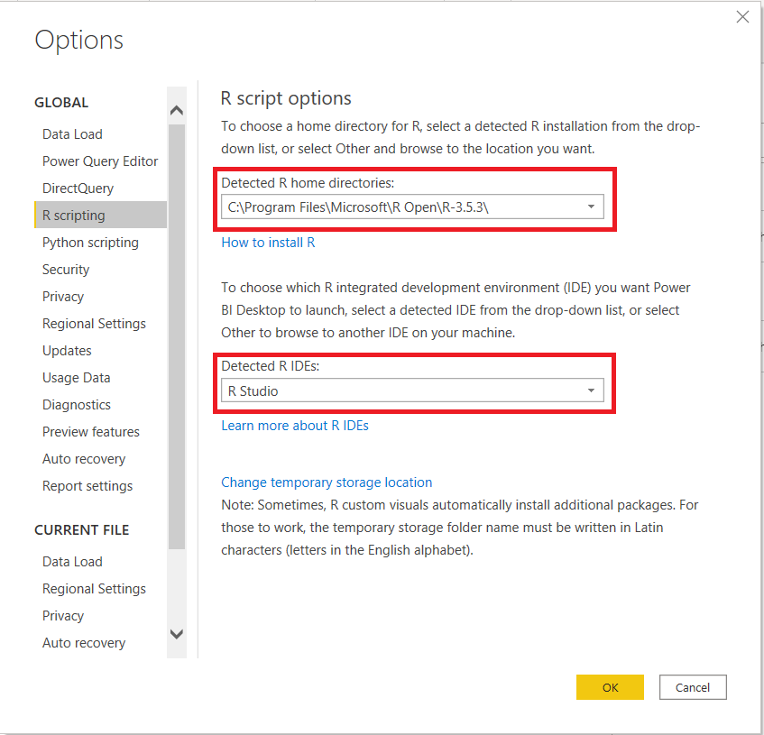

# Best Practices for Creating Stunning R Visuals in Power BI

This is the GitHub repo that covers ***Best Practices for Creating Stunning R Visuals in Power BI****. This **READE** contains some instructions on how to configure your environment to use R in Power BI. Each configuration task is clearly identified with headings.

### R Studio
The R Studio IDE is the most popular IDE for R. It is equiped with many features that facilitates R development. R Studio is available as a free download at https://rstudio.com/products/rstudio/download/. 

### Installing R
The R programming is a free open-source programming language that can be downloaded from the ***Comprehensive R Archive Network (CRAN)*** repository. Below are the instructions:

1.	Open up a browser and go to the following site:  https://cloud.r-project.org/. 
2.	Since you are setting up your environment to use R in Power BI, I will assume you are working on a Windows machine. Given that, you will need to download the version of R for Windows. You will see a link for that in the upper portion of the page. Click the link. 
3.	Clicking the link will take you to the ***R fo Windows*** page. Click on the link for the ***base*** download.
4.	Clicking on that link will take you to a page that will allow you to download the most recent version of R. You will see a link at the top of the page in the following format:  ***Download R X.X.X for Windows***. Click that link to download the current version of R.

Note that the version of R used in the Microsoft Power BI service usually lags the current version of R. I have not ran into any issues developing R visuals in a version of R that is more recent than the version of R in the Power BI service. You can find the version of R that is used in the service at the following site:  https://docs.microsoft.com/en-us/power-bi/visuals/service-r-visuals.

### R packages available in the Power BI Service
As of writing, Power BI gives you access to over 900 R packages in the Power BI service. The R packages in the service are updated irregularly and the versions of the packages are often not the most current. Given that, it is important to know what version of the package is being used in the service to ensure what you develop can be supported when deployed. Go to the following URL to get the list of R packages available in the services along with their version:  https://docs.microsoft.com/en-us/power-bi/connect-data/service-r-packages-support#r-packages-that-are-supported-in-power-bi.

### How to Install R Packages
The ***install.packages()*** function is used to install packages in R. Use the following code to install a single packages such as ***tidyverse***:
```R
install.packages("tidyverse")
```
You can also install multiple packages at once. Use the following code to install ***tidyverse*** and ***RODBC*** together:
```R
pkgs <- c("tidyverse","RODBC")
install.packages(pkgs)
```
Perform the following steps to install a specific version of a package:

1.  Go to the **CRAN Package Archive** at this URL:  https://cran.r-project.org/src/contrib/Archive/
2.  Locate the package you want to download. Once you find it, click into the folder for that package to get the list of versions that are archived for that package. Copy the URL of the package you want to download.
3.  Assign the URL to a variable and used it with the ***install.package()*** to download the package. Below is the code you would use to download ***dplyr 1.0.0***:
```R
packageurl <- "https://cran.r-project.org/src/contrib/Archive/dplyr/dplyr_1.0.0.tar.gz"
install.packages(packageurl, repos=NULL, type="source")
```

### Configure Power BI
You need to do configure Power BI to use R. To configure Power BI to use R, go to **File** > **Options and Settings** > **Options** > **R Scripting**. Doing so will bring up the form you see below. Configure the form to pick the R distribution you want to use and the IDE you want to use. An example of what the form looks like filled out is pictured below: 




